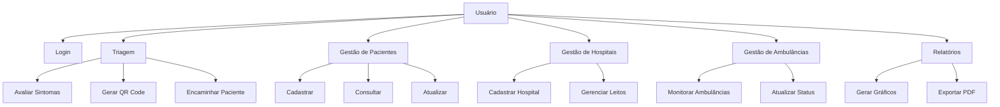
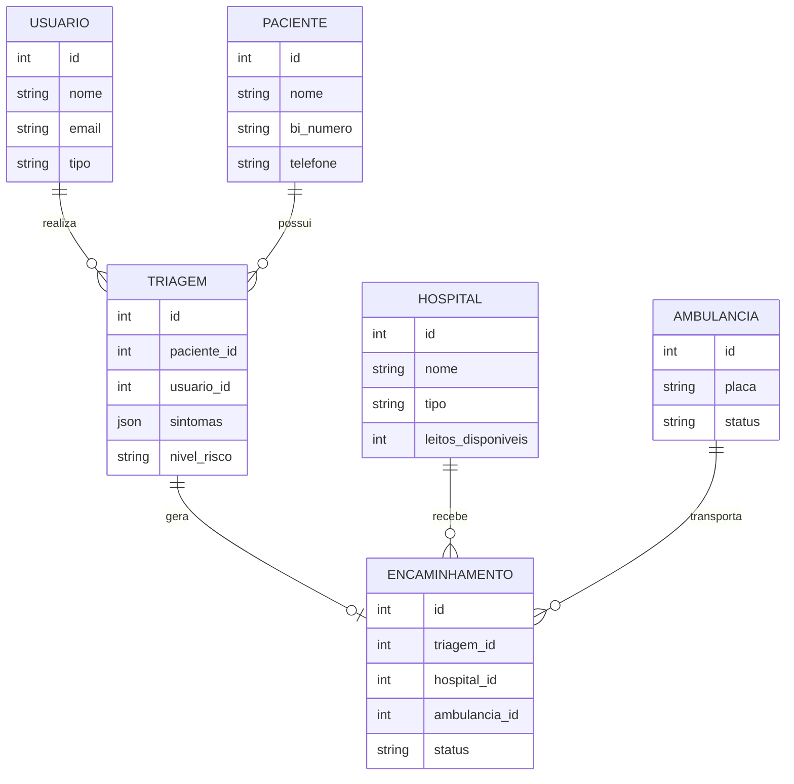

# Relatório Técnico: Sistema de Gestão e Monitoramento de Cólera em Angola

## 1. Introdução ao Problema

### 1.1 Contexto
Angola enfrenta um surto crítico de cólera, principalmente em Luanda, mas também em outras províncias como Bengo, Huambo, Cabinda e Zaire. O Ministério da Saúde de Angola necessita de uma solução tecnológica para:
- Rastreamento rápido de casos
- Triagem inteligente
- Tomada de decisão baseada em dados em tempo real
- Gestão eficiente de recursos hospitalares

### 1.2 Problemas Identificados
1. **Falta de Sistema Unificado**
   - Dados desorganizados
   - Falta de mecanismos automatizados
   - Dificuldade no mapeamento de pacientes

2. **Gestão de Recursos**
   - Controle manual de leitos
   - Dificuldade na coordenação de ambulâncias
   - Falta de visibilidade sobre disponibilidade hospitalar

3. **Monitoramento**
   - Ausência de dashboard em tempo real
   - Dificuldade na geração de relatórios
   - Falta de rastreabilidade das ações

---

## 2. Metodologia de Desenvolvimento

### 2.1 Scrum
O projeto foi desenvolvido utilizando a metodologia Scrum, com:

#### Sprints de 2 Semanas
- **Sprint Planning:** Definição de objetivos e tarefas
- **Daily Scrum:** Reuniões diárias de 15 minutos
- **Sprint Review:** Demonstração das funcionalidades
- **Sprint Retrospective:** Melhorias no processo

#### Backlog do Produto
1. **MVP (Sprint 1-2)**
   - Autenticação de usuários
   - Cadastro de pacientes
   - Triagem básica

2. **Sprint 3-4**
   - Encaminhamento automático
   - Gestão de hospitais
   - Dashboard inicial

3. **Sprint 5-6**
   - Gestão de ambulâncias
   - Relatórios avançados
   - Integração com Google Maps

---

## 3. Diagramas

### 3.1 Diagrama de Casos de Uso


### 3.2 Diagrama Entidade-Relacionamento (ER)


---

## 4. Arquitetura da Solução

### 4.1 Padrão MVC
```
├── Models (Camada de Dados)
│   ├── User.php
│   ├── Paciente.php
│   ├── Triagem.php
│   └── ...
├── Views (Frontend)
│   ├── components/
│   ├── pages/
│   └── layouts/
└── Controllers (Lógica de Negócio)
    ├── AuthController.php
    ├── TriagemController.php
    └── ...
```

### 4.2 API RESTful
- **Recursos:**
  - `/api/pacientes`
  - `/api/triagens`
  - `/api/encaminhamentos`
  - `/api/hospitais`
  - `/api/ambulancias`

- **Métodos HTTP:**
  - GET: Consulta
  - POST: Criação
  - PUT: Atualização
  - DELETE: Remoção

### 4.3 Camadas da Aplicação
1. **Apresentação**
   - Frontend (Angular)
   - Componentes reutilizáveis
   - Responsividade

2. **Aplicação**
   - Controllers
   - Services
   - Middleware

3. **Domínio**
   - Models
   - Regras de negócio
   - Validações

4. **Infraestrutura**
   - Banco de dados
   - Cache
   - Logs

---

## 5. Tecnologias Utilizadas

### 5.1 Backend
- **Laravel (PHP 8+)**
  - Framework robusto e maduro
  - ORM Eloquent
  - Sistema de migrations
  - Autenticação via Sanctum

- **MySQL**
  - Banco relacional confiável
  - Suporte a transações
  - Índices otimizados

### 5.2 Frontend
- **Angular**
  - Componentização
  - TypeScript
  - RxJS para reatividade

- **Tailwind CSS**
  - Estilização rápida
  - Responsividade
  - Customização

### 5.3 Integrações
- **Google Maps API**
  - Geolocalização
  - Cálculo de rotas
  - Visualização de mapas

- **Chart.js**
  - Gráficos interativos
  - Visualização de dados
  - Exportação

### 5.4 DevOps
- **Git**
  - Versionamento
  - Branches
  - Pull Requests

- **Docker**
  - Containerização
  - Ambiente isolado
  - Facilidade de deploy

---

## 6. Screenshots do Sistema

### 6.1 Dashboard Principal

*Visão geral do sistema com KPIs e gráficos*

### 6.2 Tela de Triagem

*Formulário de triagem com avaliação de sintomas*

### 6.3 Gestão de Ambulâncias

*Mapa com localização das ambulâncias em tempo real*

### 6.4 Relatórios

*Geração de relatórios e gráficos*

---

## 7. Conclusão

O sistema desenvolvido atende às necessidades do Ministério da Saúde de Angola, oferecendo:
- Triagem inteligente de casos
- Gestão eficiente de recursos
- Monitoramento em tempo real
- Relatórios detalhados
- Segurança e rastreabilidade

A arquitetura escolhida permite escalabilidade e manutenção, enquanto as tecnologias selecionadas garantem performance e confiabilidade.

---

## 8. Próximos Passos

1. **Expansão de Funcionalidades**
   - Integração com laboratórios
   - Sistema de notificações SMS
   - App mobile para técnicos

2. **Melhorias Técnicas**
   - Cache distribuído
   - Load balancing
   - Backup automático

3. **Treinamento**
   - Capacitação de usuários
   - Documentação detalhada
   - Suporte técnico 